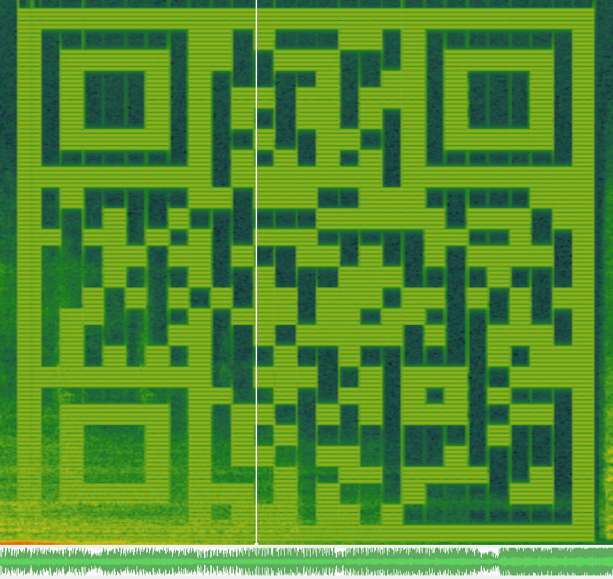
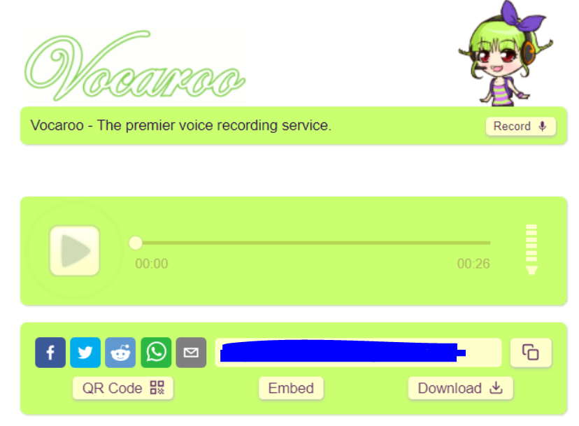
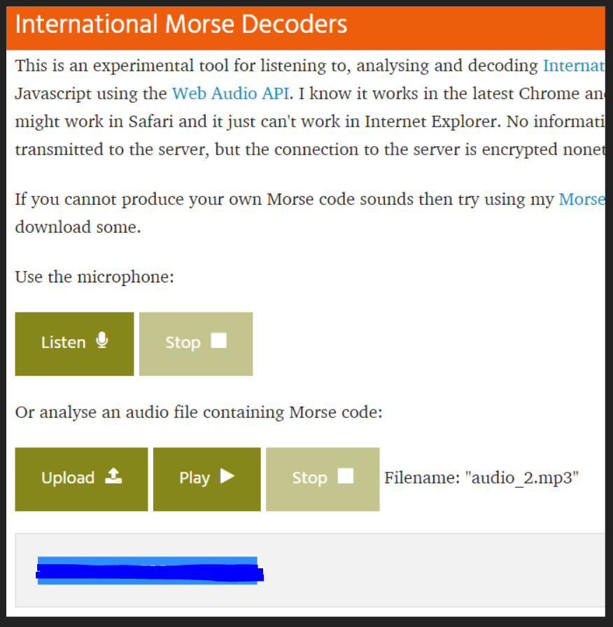
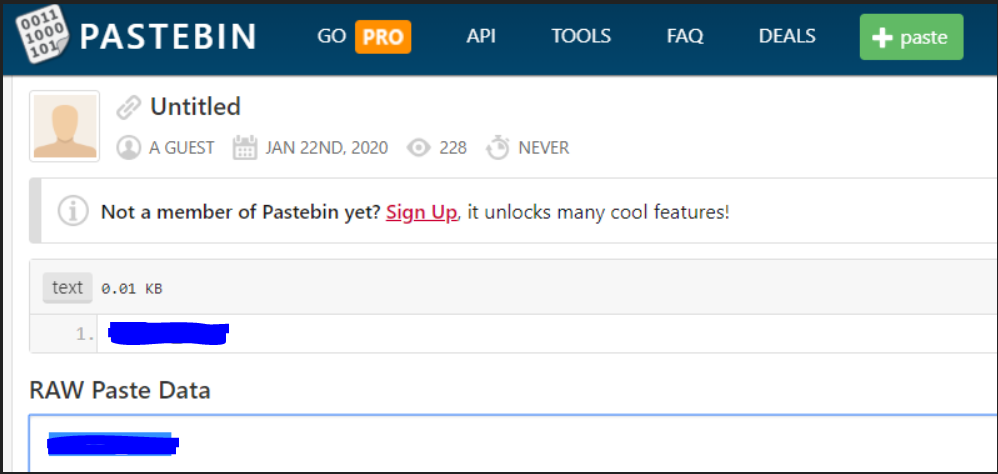

# [Musical steganography](https://tryhackme.com/room/musicalstego)

An intermediate TryHackMe room that explain 2 major ways to encrypt information within an audio file (ie. Morse code & Spectrogram) , and how to decrypt them as a walkthrough

## Musical steganography Challenge : Walkthrough

Download, visualize and listen to the audio file.

1. The answer of #2 is clear when the audio file is downloaded (Hint : **audio title/detail**)

2. Listening to the [audio](./src/audio_1.wav) and you will realise part of it sounds weird. One of the common audio steganography methods is [spectrogram](https://en.wikipedia.org/wiki/Spectrogram), which is the visual representation of the spectrum of signal frequency (including audio).

3. By adding a spectrogram to the audio and enlarge the spectrum, you will that the spectrum on the weird part turns out to be a QR code

   

4. The QR code leads you to a certain link that contains another audio file, that looks like below :

   

5. Download the audio from the webpage and listen to it. It turns out as an audio with only 2 different frequencies (ie. 'bip' sound & pause), just like how [morse code](https://en.wikipedia.org/wiki/Morse_code) functions. (Morse code is a method used in telecommunication to encode text characters as standard sequences of 2 different signal durations)

6. 'Decode' this audio with an [online morse code audio decoder](https://morsecode.world/international/decoder/audio-decoder-adaptive.html) (ie. play it), and it will returns another link.

   

7. Redirect to another webpage that contains a certain string. According to the question it seems like a password for a certain encrypted file (should be the final flag).

   

8. Since there are no further link or new resources from this step, thus we can assume that the flag is probably hidding within one of those audio files

9. Starting from the first [audio](./src/audio_1.wav) audio. Since it is a WAV format audio, thus I will use [steghide](https://github.com/StefanoDeVuono/steghide) here to extract the encrypted file

10. As a CLI tool, the following command is used to extract the flag file and you can output the flag with command **cat** from the named file with flag **-xf**

    ```Bash
        steghide extract -sf <source_file> -p <password> -xf <extracted_file_name>
    ```

    
