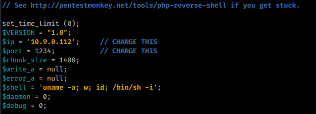
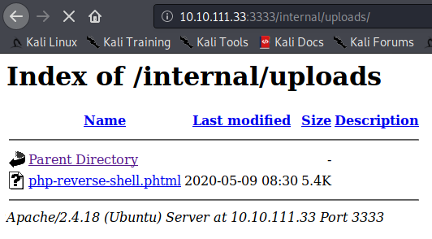

# Vulnversity Write Up

A TryHackMe beginner level room, which contains the basic information about active recon (reconnaissance), web app attacks and privilege escalation

## [Task 1] Deploy the machine

Required OpenVPN to connect to corresponding server

## [Task 2] Reconnaissance

A key phrase in pentest to gather information passively, in order to find out the vulnerable areas of the target system or software.

Nmap is used here to gather information about this machine, as a network scanner

### #1. Scan this box

```Bash
    nmap -sV <machine ip>
```

### #2. Scan the box, how many ports are open?

Based on the scanning result in previous question.

#### Result : 6

### #3. What version of the squid proxy is running on the machine?

Since there is flag **-sV** used, which allows to determine the version of the services running on this machine.

#### Result : 3.5.12

### #4. How many ports will nmap scan if the flag -p-400 was used ?

Flag -p is used to do port scanning, to find out open port of the target host within a specified port range. Here is how to specify the port number range to be scanned :

```Bash
-p <port_number>    # Scan for specific port with that port_number
-p-<port_number>    # Scan all ports within range 0 to port_number
-p-                 # Scan all ports possible
```

#### Result : 400

### #5. Using the nmap flag -n what will it not resolve ?

#### Hint : IP to hostname

#### Result : DNS

### #6. What is the most likely operating system this machine is running

#### Hint : Run nmap with the **-O** flag

#### Result : ubuntu

### #7. What port is the web server running on ?

#### Result : 3333

## [Task 3] Locating directories using GoBuster

[GoBuster](https://github.com/OJ/gobuster) is a remote directory discovery tool, to brute-force URIs (directories and files), DNS subdomains and virtual host names. Here we use it to brute-force directories on the target host.

Note : You need to have a wordlist to brute-force the directories. I use this [wordlist](https://github.com/danielmiessler/SecLists/blob/master/Discovery/Web-Content/common.txt), which you can find on **/usr/share/wordlists/dirbuster** if you are using Kali

### #2. What is the directory that has an upload form page ?

```Bash
    gobuster dir -u http://<ip>:3333 -w <path_to_wordlist>
```

- Option **dir** is used, since we are finding hidden directories
- Port 3333 is used, since it is where the web server running on

#### Note : It won't be discovered if there is no entry of word _'internal'_ in your wordlist

#### Result : /internal/

## [Task 4] Compromise the webserver

Now a form to upload files is found on the machine, which can be a vulnerability on this web application, that got it compromised.

### #1. Try upload a few file types to the server, what common extension seems to be blocked ?

#### Result : .php

### #2. Intro to Burp Suite

Burp Suite is a graphical web application security testing software. It is installed by default on Kali, else you can find it [here](https://portswigger.net/burp). Community version is enoguh for us to launch testing on this machine.

### #3. Launch payload to the upload form with Burp Suite

All 5 extensions given in phpext.txt are recognized as different PHP file format.

#### How to

- Add payload options to the attacking launcher, by manually input each extension or upload as a wordlist

  

- Make sure you have full POST-request information by upload an arbitrary .php file, as an attack payload position setup. They can be found in HTTP history.

  

- The highlighted part is where the payload option will be inserted in attack

  

- Launch the attack and the result for each payload will be returned
- Upload **Fail** example :

  

- Upload **Success** example :

  

- This kind of common but serious vulnerability is called [Unrestricted File Upload](https://owasp.org/www-community/vulnerabilities/Unrestricted_File_Upload), that allows attacker to launch both client-side & server-side attacks, depends on the web application architecture and code uploaded

#### Result : _.phtml_

### #4. Reverse shell

1. We use a PHP script to achieve the goal, which can found on Kali (install by default), or link [here](http://pentestmonkey.net/tools/php-reverse-shell)

2. The exploit above accepts .phtml format of PHP file only, so we need to rename it and modify the code to an IP of your choice (for establishing connection to the file on host server).

   
   

3. Upload the .phtml file to the upload form, which you can find it at relative URL **_/internal/uploads/_**

   

4. The script file uploaded open an outbound TCP connection from the webserver to a host and port of your choice. It will be activated by clicking the script file, ie. executed.
5. Before that, we need something to do the reading and writing to the network connection established from the script. Here, we are using [netcat](https://en.wikipedia.org/wiki/Netcat) for this purpose.

6. It can be done with the following command, as it is installed by default on Kali.

   ```Bash
   nc -vnl -p <port_specified_in_script>
   ```

   Before the script launched on the host server :
   

   After clicking on the script on host (executed) :
   

### #5. What user was running the web server ?

It can be achieved by traverse to the /home directory and list all directory available.


#### Result : bill

## [Task 5] Privilege Escalation

[Privilege Escalation](https://en.wikipedia.org/wiki/Privilege_escalation) means the act of _exploiting a bug, design flaw or configuration oversight in an operating system or application to gain elevated access to resources that are normally protected from an application or user_. It results in more privileges than intended are obtained, and possible to perform unauthorized action. We will use the exploitation found above to get access to the host.

After compromised this machine, becoming the superuser of this ubuntu web server allows us to have more power to control it

### #1. Find the target SUID file

SUID (Set owner UserID upon execution) is a special type of file permission, that give temporary permissions to a user to run the program/file with the permission of the file owner (rather than as the user who runs it).

To know more about SUID, click [here](https://www.linuxnix.com/suid-set-suid-linuxunix/)

#### Hint : Use the command

```Bash
    find / -user root -perm -4000 -exec ls -ldb {} \;
```

- 4000 is a mode convention integer for constant **S_ISUID**, associated with _"setuid"_
- Reference : https://unix.stackexchange.com/questions/145114/file-permission-with-setuid-and-octal-4000

It allows us to find out the way to be superuser on the host server

#### Result : /bin/systemctl

### #2. Become root and get the last flag (/root/root.txt)

What is [/bin/systemctl](https://www.linode.com/docs/quick-answers/linux-essentials/introduction-to-systemctl/) ?

- It is a binary that controls interfaces for init systems (systemd) and service managers
- It launches all those services that happen during the boot time, by searching those task files in **/etc/system/systemd**

### How to : ([Reference](https://gtfobins.github.io/gtfobins/systemctl))

1. Although we can't access to /root and thus we can't make the unit file, we still can create environment variable

   

2. We create a unit file and assign this to the environment variable.

   

3. It creates a service which will be executed with Bash shell (/bin/bash) :

   - Flag **-c** for bash enables the command read from the first non-option argument command string
   - The service is actually consist a line of command **cat ...**

4. Execute that unit file by using **systemctl** binary

   

   - Option **link** _links the unit file into the search path_ when executing any command
   - Option **enable** _enables_ the specified unit file to be executed
   - Flag **--now** _starts the unit file after enabling it_

5. Now the target file can be found in the _/opt/flag_ directory
